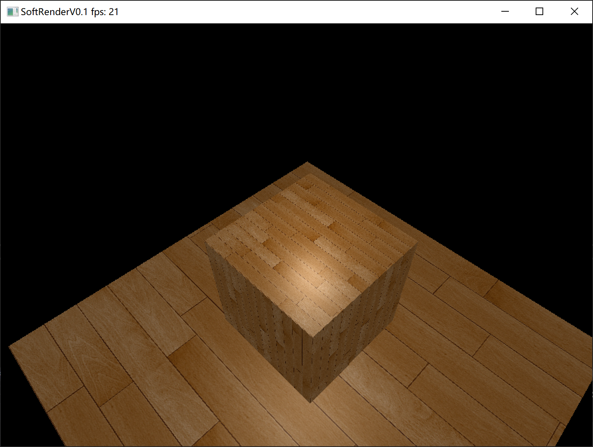
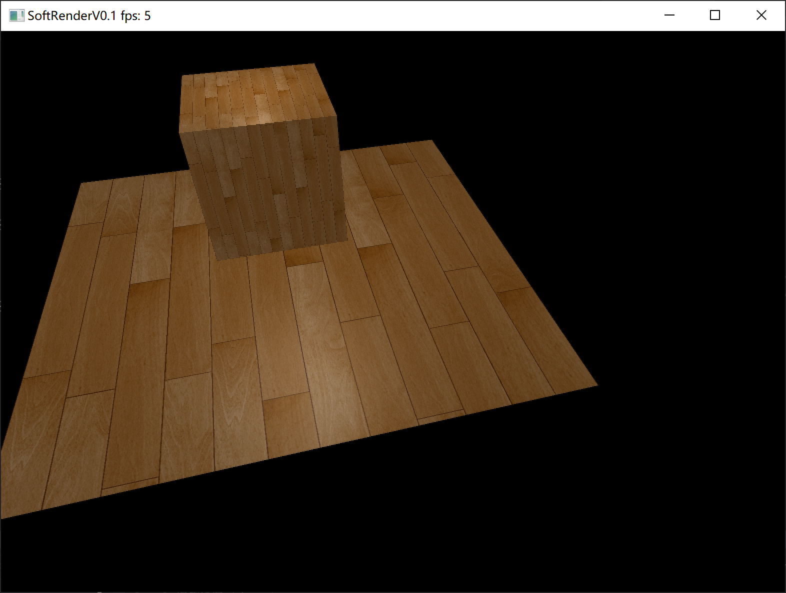
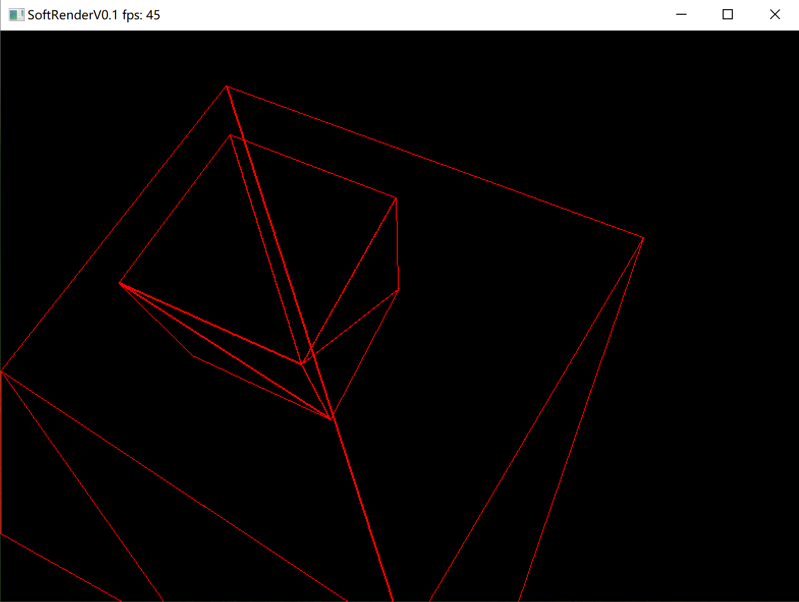
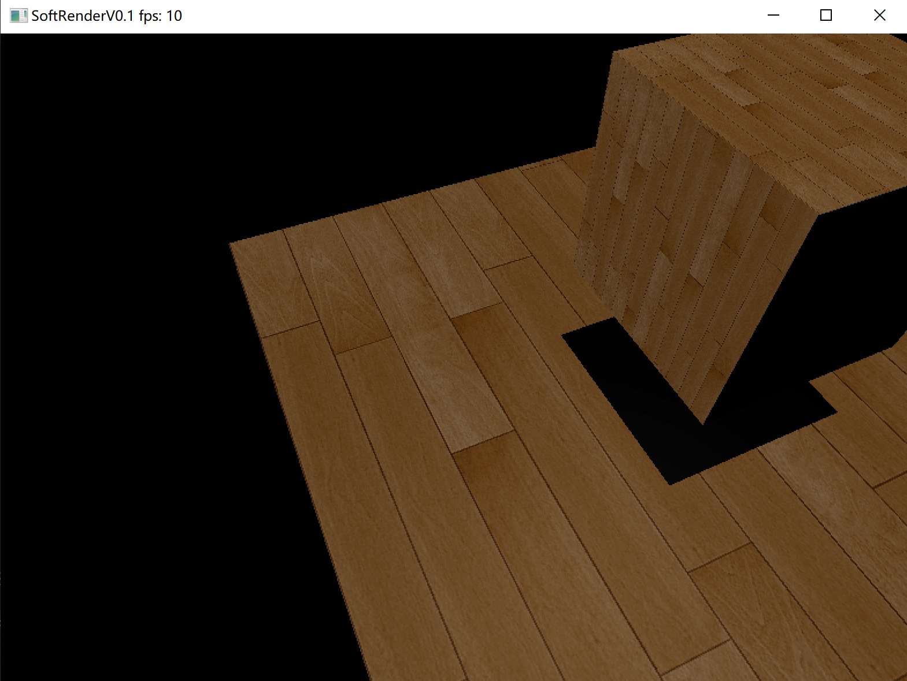

# SoftRenderer

## Words at the beginning
    
Hello, Welcome to my Project named `SoftRendered`.As you can see, this project is built to help me to grasp the knowledge of computer graphics.Without further ado, let me introduce you to the project.By the way, if this project could help you in some way, I hope you can star⭐ it!

***

## Environment
- Languages : `c++`
- IDE : `Visual Studio 2019`
- Three party Library : `GLM` `stb_image`

***

## Main Features

### Rasterization

Implemented rasterization based on the framebuffer, and completed the work related to culling and clipping.

### Render Pipeline

Simulated a real rendering pipeline and created a shader class to enable processing of various vertex data.

### Model Loader

A obj model loader. An obj model can be composed of multiple objects, which can be decomposed into Mesh and Texture for easy rendering.

`Basic lighting, blinn-phong shading, ...` More features will be added soon...

***

## 2023.03.10

### Basic lighting && blinn-phong shading

### MSAA

 

### Wireframe Mode
 

### Shadow
 